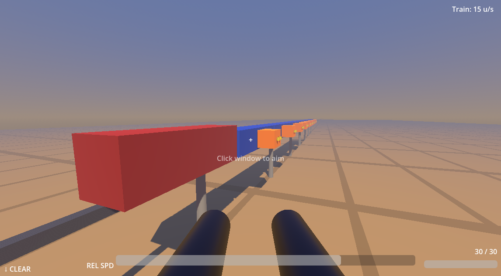

# Wild Jam 26-03

A rail-shooter built in Godot 4.6 (C#). You fly alongside a speeding train, blasting clamps off cargo containers to steal the load before the locomotive pulls out of range.

## Download

Pre-built releases are available in the [Releases](../../releases) section.

## Disclaimer

This project was created for [Godot Wild Jam #19](https://itch.io/jam/godot-wild-jam-19) but was **not submitted** to the jam, as AI coding agents were used extensively during development. Per the jam's spirit of human-made entries, it was kept out of the competition.